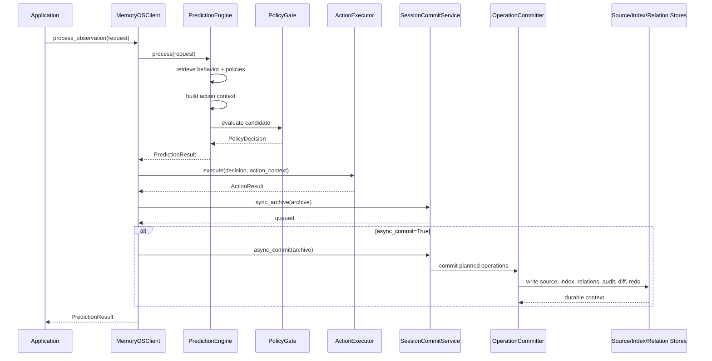
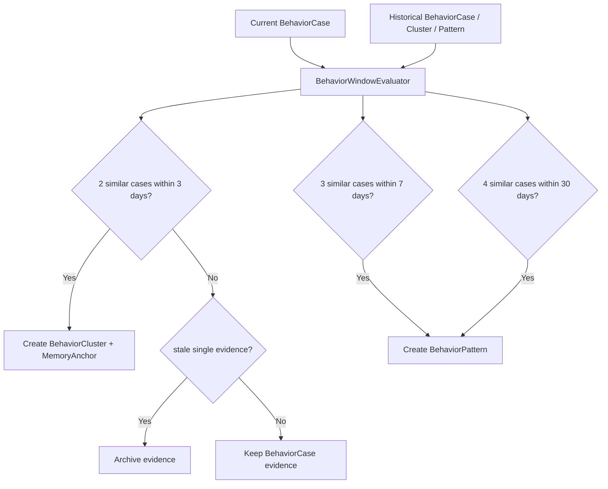
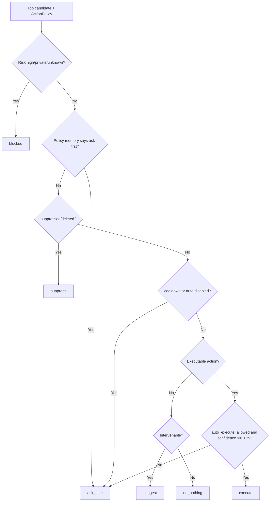
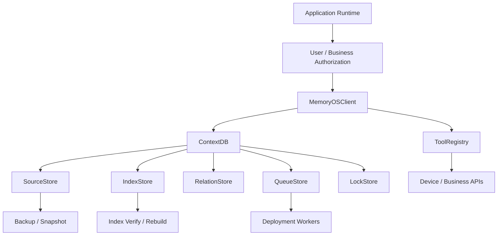

# MemoryOS

[English](README.md) | [简体中文](README.zh-CN.md)

[](https://github.com/kkxx939-bot/memoryOS/actions/workflows/ci.yml)


MemoryOS is a **Predictive Context Database for AI Agents**.

It is not a chat-history wrapper, a memory-only SDK, or a vector database abstraction. MemoryOS is a local-first context substrate for long-running agents: it stores durable user facts, learns behavior patterns, maintains action policies, predicts useful actions, gates automatic execution, and commits execution feedback back into long-term context.

Production entrypoint:

```text
MemoryOSClient.process_observation(request, ...)
```

Core loop:

```text
observation
-> prediction
-> action context packing
-> policy gate
-> optional tool execution
-> session archive
-> context operations
-> durable memory / behavior / action-policy updates
```

## Why MemoryOS

Most memory SDKs answer "what did the user say before?" MemoryOS focuses on production agent questions:

| Question | MemoryOS answer |
| --- | --- |
| What does the user usually do in this scene? | `BehaviorCase`, `BehaviorCluster`, `BehaviorPattern` |
| Which action is most useful now? | `ActionPolicyRetriever` + `ActionPolicyRanker` |
| Can this action run automatically? | `PolicyGate` + `ActionExecutor` |
| Which context is required for this action? | `ActionContextBuilder` + relation-first packing |
| How does feedback become long-term learning? | `SessionArchive` + planners + `OperationCommitter` |
| What happens if a write is interrupted? | `RedoLog`, `ContextDiff`, audit, source/index consistency |

The central invariant is:

```text
Prediction is runtime logic.
Durable update is operation-plane logic.
```

`PredictionResult` never writes durable memory. Long-term updates are produced only through session commit, planners, `ContextOperation`, and `OperationCommitter`.

## Features

- **Predictive Context Database**: one `ContextDB` for memory, behavior, action policy, resource, skill, and session context.
- **Local-first source of truth**: `FileSystemSourceStore` stores durable facts; SQLite-backed index, relation, queue, and lock stores are the default local production implementation.
- **Relation-first context packing**: loads context through `anchored_by`, `constrained_by`, `supported_by`, `requires_resource`, `requires_skill`, and related edges before falling back to search.
- **Safe execution boundary**: `PolicyGate` decides whether a candidate may execute; `ActionExecutor` validates resources, skills, registered tools, and arguments.
- **Operation plane**: production writes flow through `ContextOperation`, target resolution, coalescing, conflict resolution, path locking, redo, audit, and diff writing.
- **Behavior lifecycle**: `BehaviorWindowEvaluator` is the production logic for behavior cluster and pattern upgrades.
- **Supersede semantics**: `SUPERSEDE` marks the old object `obsolete`, writes a new active object, stores supersede metadata, and creates `supersedes` / `superseded_by` relations.
- **Feedback learning**: action success, failure, and blocked outcomes become feedback for action-policy reward and penalty updates.
- **Recovery and consistency**: SourceStore is the source of truth; indexes are derived and rebuildable; redo prevents repeated reward/penalty application after interruption.

## What MemoryOS Is Not

MemoryOS is not:

- an LLM provider,
- a hosted vector database,
- a general autonomous-agent framework,
- a distributed database,
- a business authorization system,
- a replacement for application-level device or tool permissions.

Bring your own LLM, embedding provider, vector store, external APIs, authentication, authorization, secrets, worker supervision, and deployment observability.

## Architecture

```mermaid
flowchart TD
    App[External Agent / Application] --> Client[MemoryOSClient]

    Client --> Predict[PredictionEngine]
    Client --> Exec[ActionExecutor]
    Client --> DB[ContextDB]

    Predict --> Norm[ObservationNormalizer]
    Predict --> Sim[SimilarBehaviorRetriever]
    Predict --> Ret[ActionPolicyRetriever]
    Predict --> Rank[ActionPolicyRanker]
    Predict --> Pack[ActionContextBuilder]
    Predict --> Gate[PolicyGate]
    Predict --> Ledger[PredictionLedger]

    Exec --> Registry[ToolRegistry]
    Exec --> Result[ActionResult]

    DB --> Source[SourceStore]
    DB --> Index[IndexStore]
    DB --> Relations[RelationStore]
    DB --> Queue[QueueStore]
    DB --> Locks[LockStore]
    DB --> Session[SessionCommitService]
    DB --> Committer[OperationCommitter]

    Session --> MemoryPlanner[MemoryCommitPlanner]
    Session --> BehaviorPlanner[BehaviorCommitPlanner]
    Session --> PolicyPlanner[ActionPolicyCommitPlanner]
    Session --> ContextPlanner[ContextCommitPlanner]

    Committer --> Resolver[TargetResolver]
    Committer --> Coalescer[OperationCoalescer]
    Committer --> Conflict[ConflictResolver]
    Committer --> PathLock[PathLock]
    Committer --> Redo[RedoLog]
    Committer --> Audit[AuditWriter]
    Committer --> Diff[DiffWriter]
```



## Runtime Flow

`process_observation(...)` is the production runtime path. It predicts, optionally executes, archives the session, and commits durable updates.



Important: in the default SDK path, `async_commit=True` immediately runs the async commit phase after writing the archive. Queue records are still written for deployment-level workers and refresh flows, but the local SDK path remains deterministic.

## Context Model

All durable context is represented as a `ContextObject`.

```text
uri
context_type
title
owner_user_id
tenant_id
layers
metadata
relations
lifecycle_state
hotness
semantic_hotness
behavior_support_hotness
created_at
updated_at
schema_version
```

Supported context types:

```text
memory
behavior_case
behavior_cluster
behavior_pattern
action_policy
prediction_ledger
session
resource
skill
```

The semantic separation is intentional:

- `Memory` stores durable facts, preferences, policy memories, and memory anchors.
- `Behavior` stores cases, clusters, patterns, and opportunity evidence.
- `ActionPolicy` stores durable action value, safety status, resource/skill requirements, rewards, penalties, cooldown, and suppression state.

Behavior evidence can support memory and policy decisions, but it must not silently overwrite explicit memory.

## Storage Layout

Default local stores:

```text
FileSystemSourceStore  -> source of truth
SQLiteIndexStore       -> searchable derived index
SQLiteRelationStore    -> context relation graph
SQLiteQueueStore       -> local job queue
SQLiteLockStore        -> path-level commit locks
```

Typical root path:

```text
memoryos-data/
  tenants/
    default/
      users/
        <user_id>/
          memories/
          behavior/
          action_policies/
          sessions/
  indexes/
    context.sqlite3
    relations.sqlite3
  queues/
    jobs.sqlite3
  system/
    locks.sqlite3
    audit/
    diffs/
    redo/
```

SourceStore is the source of truth. IndexStore is derived and can be rebuilt.

## Operation Plane

Production long-term writes should use `ContextOperation`.


Supported operation actions:

```text
add
update
delete
supersede
merge
confirm
reject
reward
penalize
cooldown
suppress
disable
archive
compress
refresh_layers
reindex
```

Production guarantees:

- `ContextDB.commit_operations(...)` batches operations by `user_id` before committing.
- Same-batch operations can be coalesced and conflict-resolved together.
- `update + delete` on the same target resolves to delete.
- `reward + penalty` on the same policy is merged or resolved by `ConflictResolver`.
- `SUPERSEDE` marks the old object `obsolete`, writes the replacement as `active`, stores supersede metadata, and updates relations.
- Default active retrieval excludes `deleted`, `archived`, and `obsolete` objects.
- Redo phases prevent interrupted writes from applying reward or penalty twice.

## Behavior Lifecycle

Production behavior lifecycle logic is centralized in `BehaviorWindowEvaluator`.



Rules:

- 2 similar cases within 3 days can create a cluster.
- 3 similar cases within 7 days can create a pattern.
- 4 similar cases within 30 days can create a pattern.
- Missing or invalid `created_at` evidence can be archived but cannot trigger cluster or pattern upgrades.
- `BehaviorLifecycleService` is kept only as a compatibility wrapper and delegates to `BehaviorWindowEvaluator`.

## Action Context Packing

`ActionContextBuilder` builds the minimum context required by top candidate actions.

Sections:

```text
memory_rules
memory_anchor
behavior_pattern
action_policy
resource
skill
recent_session
```

Relation mapping:

| Relation | Packed section |
| --- | --- |
| `anchored_by` | `memory_anchor` |
| `constrained_by` | `memory_rules` |
| `supported_by` | `behavior_pattern` |
| `requires_resource` | `resource` |
| `requires_skill` | `skill` |
| `uses_session` | `recent_session` |

When relations are incomplete, MemoryOS can fall back to index search.

## Safety Model

Automatic execution requires two gates:

1. `PolicyGate` must return `mode="execute"`.
2. `ActionExecutor` must validate resource context, skill context, tool registration, and tool arguments.

Decision modes:

```text
execute
ask_user
suggest
do_nothing
suppress
blocked
```



Execution also requires:

- Resource context exists.
- Skill context exists.
- Skill metadata has `executable=True`.
- Tool name is registered in `ToolRegistry`.
- Tool args pass schema-like validation.

## Quick Start

MemoryOS currently runs from source.

```bash
git clone https://github.com/kkxx939-bot/memoryOS.git
cd memoryOS

python -m venv .venv
source .venv/bin/activate

pip install -r requirements.txt
```

Minimal prediction call:

```python
from memoryos.api.sdk.client import MemoryOSClient
from memoryos.prediction.model.prediction_request import PredictionRequest

client = MemoryOSClient("./memoryos-data")

request = PredictionRequest(
    user_id="u1",
    episode_id="ep-001",
    observation={
        "raw_text": "Room temperature is 30C and the user is home.",
        "location": "home",
        "environment": {"temperature": 30},
    },
    available_actions=["turn_on_ac", "turn_on_fan", "ask_user", "do_nothing"],
    token_budget=1500,
)

result = client.process_observation(
    request,
    archive_session=True,
    async_commit=True,
)

print(result.decision.mode)
print(result.decision.action)
print(result.decision.reason)
```

If no behavior, action policy, resource, skill, or registered tool exists yet, the safe result may be `do_nothing`, `ask_user`, `suggest`, or `blocked`. That is expected.

## Executable Example

This example seeds the minimum context required for a low-risk executable action.

```python
import json

from memoryos.action_policy.model.action_policy import ActionPolicy
from memoryos.api.sdk.client import MemoryOSClient
from memoryos.behavior.model.observation import Observation
from memoryos.contextdb.model.context_object import ContextObject
from memoryos.contextdb.model.context_relation import ContextRelation
from memoryos.contextdb.model.context_type import ContextType
from memoryos.prediction.model.prediction_request import PredictionRequest
from memoryos.skill.tool_registry import ToolRegistry


def ac_tool(payload: dict) -> dict:
    return {"ok": True, "device_id": payload["device_id"], "temperature": payload["temperature"]}


registry = ToolRegistry()
registry.register(
    "ac.turn_on",
    ac_tool,
    input_schema={
        "type": "object",
        "required": ["device_id", "temperature"],
        "properties": {
            "device_id": {"type": "string"},
            "temperature": {"type": "number"},
        },
    },
)

client = MemoryOSClient("./memoryos-data", tool_registry=registry)
observation = Observation(user_id="u1", raw_text="hot room", location="home", environment={"temperature": 30})

anchor_uri = "memoryos://user/u1/memories/anchors/hot"
resource_uri = "memoryos://resources/ac"
skill_uri = "memoryos://skills/ac"

client.context_db.seed_object(
    ContextObject(uri=anchor_uri, context_type=ContextType.MEMORY, title="hot anchor", owner_user_id="u1"),
    content="User often cools the room when it is hot at home.",
)
client.context_db.seed_object(
    ContextObject(
        uri=resource_uri,
        context_type=ContextType.RESOURCE,
        title="Living room AC",
        metadata={"available": True, "device_id": "ac", "temperature": 24},
    ),
    content="available",
)
client.context_db.seed_object(
    ContextObject(
        uri=skill_uri,
        context_type=ContextType.SKILL,
        title="AC control skill",
        metadata={
            "tool_name": "ac.turn_on",
            "executable": True,
            "input_schema": {
                "type": "object",
                "required": ["device_id", "temperature"],
                "properties": {
                    "device_id": {"type": "string"},
                    "temperature": {"type": "number"},
                },
            },
            "risk_level": "low",
        },
    ),
    content="tool",
)

policy = ActionPolicy(
    user_id="u1",
    scene_key=observation.scene_key,
    action="turn_on_ac",
    memory_anchor_uri=anchor_uri,
    q_value=0.95,
    confidence=0.95,
    reward_score=10.0,
    auto_execute_allowed=True,
    required_resource_uris=[resource_uri],
    required_skill_uris=[skill_uri],
)

client.context_db.seed_object(policy.to_context_object(), content=json.dumps(policy.to_dict()))
client.context_db.add_relation(ContextRelation(source_uri=policy.uri, relation_type="anchored_by", target_uri=anchor_uri, metadata={"owner_user_id": "u1"}))
client.context_db.add_relation(ContextRelation(source_uri=policy.uri, relation_type="requires_resource", target_uri=resource_uri, metadata={"owner_user_id": "u1"}))
client.context_db.add_relation(ContextRelation(source_uri=policy.uri, relation_type="requires_skill", target_uri=skill_uri, metadata={"owner_user_id": "u1"}))

request = PredictionRequest(
    user_id="u1",
    episode_id="ep-execute",
    observation=observation,
    available_actions=["turn_on_ac", "ask_user", "do_nothing"],
    token_budget=2000,
)

result = client.process_observation(request, archive_session=True, async_commit=True)
print(result.decision.mode)
```

`seed_object(...)` is for bootstrap, imports, and tests. Production long-term updates should use `ContextOperation`, `ContextDB.commit_operation(...)`, `ContextDB.commit_operations(...)`, or session commit.

## Production Integration

Recommended integration shape:



Production checklist:

- Use `process_observation(...)` for runtime flows.
- Treat `predict(...)` as a lower-level read-only prediction API.
- Seed or commit durable memory, behavior, resource, skill, and action-policy context before expecting execution.
- Register only safe tool handlers in `ToolRegistry`.
- Keep application-level user authorization outside MemoryOS.
- Monitor `system/audit`, `system/diffs`, `system/redo`, and queue status.
- Verify or rebuild indexes after store migration or recovery.
- Do not bypass `OperationCommitter` for production long-term writes.
- Keep Memory, Behavior, and ActionPolicy semantically separate.

## CLI and Thin Adapters

The package includes lightweight local adapters:

```bash
python -m memoryos.api.cli.main version
python -m memoryos.api.cli.main inspect-architecture
```

HTTP and MCP modules are thin predict adapters around the SDK. They are not a full hosted service; production deployment should wrap the SDK with your own auth, rate limits, secrets, observability, and worker supervision.

## Development

Install dependencies:

```bash
pip install -r requirements.txt
```

Run checks:

```bash
python -m compileall -q memoryos tests
ruff check memoryos tests
mypy memoryos tests
pyright memoryos tests
python -m pytest
```

The CI workflow targets Python 3.10 and runs compile, lint, type checks, and tests.

## Repository Map

```text
memoryos/
  api/                  SDK, CLI, HTTP and MCP adapter surface
  action_policy/        Action policy model, retrieval, ranking and updates
  behavior/             Observation, behavior cases, windows, patterns and cooling
  contextdb/            ContextDB facade, stores, layers, sessions and transactions
  memory/               Memory model, extraction, lifecycle, service and store boundaries
  operations/           Operation model, committer, coalescer, conflict resolver, redo
  prediction/           Prediction request/result, engine, gate and executor
  providers/            Provider interfaces
  runtime/              Runtime config and dependency wiring
  security/             Action risk and safety helpers
  skill/                Tool registry and skill helpers
  workers/              Background-style maintenance workers

examples/
  Public API usage examples.

benchmark/
  Lightweight benchmark skeleton and smoke checks.

tests/
  unit/
  integration/
  e2e/

docs/architecture/
  Design notes for ContextDB, operation plane, prediction pipeline and closure.
```

## Current Boundaries

MemoryOS is production-oriented, but intentionally local-first and embeddable.

Out of scope for the default implementation:

- hosted control plane,
- distributed database guarantees,
- managed vector database,
- built-in LLM provider,
- built-in device authorization,
- full tenant IAM,
- secret management,
- worker process supervision,
- dashboards and alerting.

These remain application and deployment responsibilities.

## Invariants

1. `process_observation(...)` is the production runtime entrypoint.
2. `PredictionResult` never carries durable memory operations.
3. Long-term updates are generated by session commit planners.
4. Production writes go through `ContextOperation`.
5. `OperationCommitter` coordinates source, index, relation, audit, diff, redo, and lock.
6. `SourceStore` is the source of truth.
7. `IndexStore` is derived and rebuildable.
8. `Memory`, `Behavior`, and `ActionPolicy` are separate semantic layers.
9. Behavior evidence must not overwrite explicit memory.
10. Action policy updates must be expressed as reward, penalty, cooldown, suppress, disable, or related operations.
11. Automatic execution must pass `PolicyGate`.
12. Tool execution must pass through `ActionExecutor`.
13. External business authorization remains the application layer's responsibility.

## Project Status

Version: `0.1.0`

MemoryOS currently provides a production-oriented local architecture, a deterministic operation plane, and test-covered e2e flows. The default implementation is suitable for local-first agent systems, embedded agent runtimes, prototypes that need production-grade write semantics, and applications that bring their own LLM, vector store, tools, and deployment layer.
