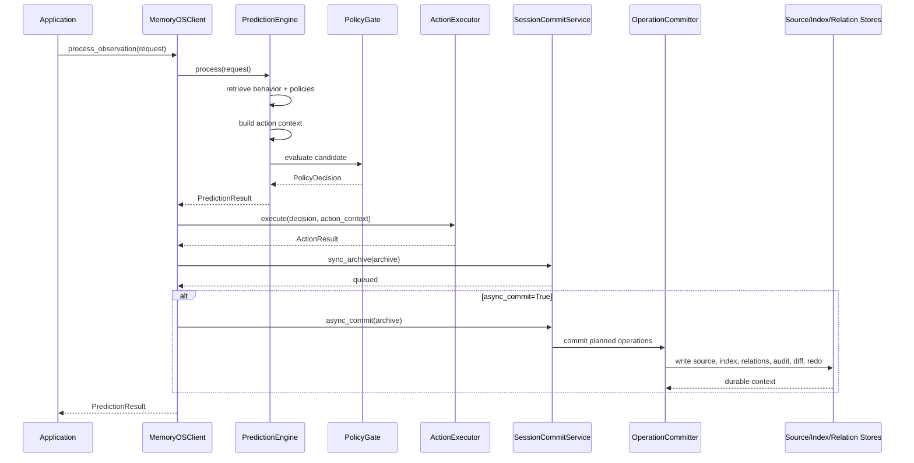
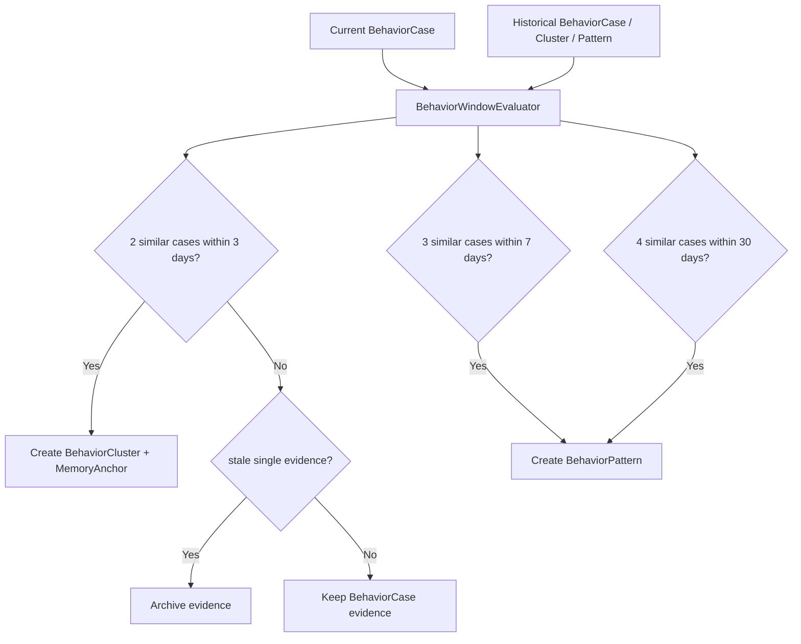
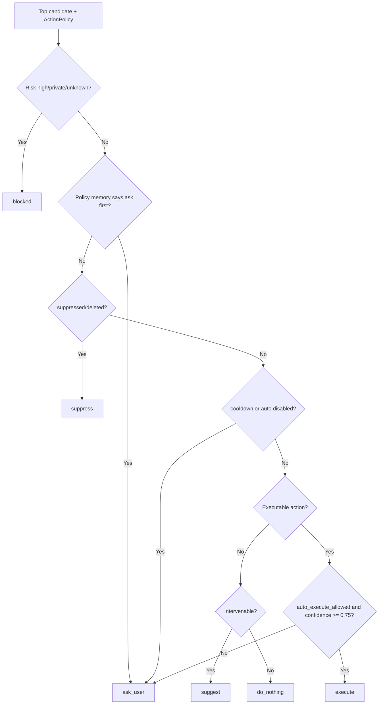
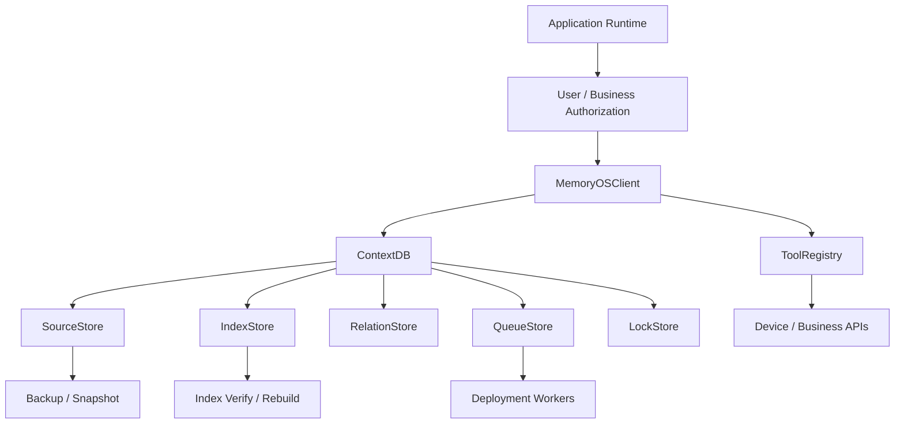

# MemoryOS

[English](README.md) | [简体中文](README.zh-CN.md)

[](https://github.com/kkxx939-bot/memoryOS/actions/workflows/ci.yml)


MemoryOS 是一个面向 AI Agent 的 **Predictive Context Database**。

它不是普通聊天历史库，也不是向量数据库包装层。MemoryOS 的目标是给长期运行的 Agent 提供一个 local-first 的上下文底座：保存用户事实，沉淀行为证据，维护动作策略，预测下一步可能动作，在自动执行前做安全门禁，并把执行反馈继续写回长期上下文。

生产入口是：

```text
MemoryOSClient.process_observation(request, ...)
```

核心闭环是：

```text
observation
-> prediction
-> action context packing
-> policy gate
-> optional tool execution
-> session archive
-> context operations
-> durable memory / behavior / action-policy updates
```

## 为什么是 MemoryOS

普通 memory SDK 通常回答“用户说过什么”。MemoryOS 关注的是 Agent 在生产运行中真正需要的上下文问题：

| 问题 | MemoryOS 中的答案 |
| --- | --- |
| 用户在这个场景下通常会怎么做？ | `BehaviorCase`、`BehaviorCluster`、`BehaviorPattern` |
| 当前候选动作是什么？ | `ActionPolicyRetriever` + `ActionPolicyRanker` |
| 这个动作是否能自动执行？ | `PolicyGate` + `ActionExecutor` |
| 执行需要哪些上下文？ | `ActionContextBuilder` + relation-first packing |
| 本轮反馈如何变成长期学习？ | `SessionArchive` + planners + `OperationCommitter` |
| 写入失败或中断怎么办？ | `RedoLog`、`ContextDiff`、audit、source/index consistency |

MemoryOS 坚持一个边界：

```text
Prediction is runtime logic.
Durable update is operation-plane logic.
```

`PredictionResult` 不写长期记忆。长期更新只通过 session commit、planner、`ContextOperation` 和 `OperationCommitter` 完成。

## 核心能力

- **Predictive Context Database**: 用统一的 `ContextDB` 管理 memory、behavior、action policy、resource、skill、session。
- **Local-first source of truth**: `FileSystemSourceStore` 保存事实源，SQLite index/relation/queue/lock 作为本地生产默认实现。
- **Relation-first context packing**: 优先使用 `anchored_by`、`constrained_by`、`supported_by`、`requires_resource`、`requires_skill` 等关系加载上下文。
- **Safe auto-execution boundary**: `PolicyGate` 决定是否 `execute`，`ActionExecutor` 负责 resource、skill、tool、args 校验。
- **Operation plane**: 所有生产长期写入通过 `ContextOperation`，支持 target resolve、coalesce、conflict resolve、path lock、redo、audit、diff。
- **Behavior lifecycle**: 由 `BehaviorWindowEvaluator` 统一判断 cluster/pattern 生成窗口。
- **Supersede semantics**: `SUPERSEDE` 会将旧对象标记为 `obsolete`，写入新 active 对象，并维护 `supersedes` / `superseded_by` 关系。
- **Feedback learning**: action success/failure/blocked 会转成 feedback，驱动 action policy reward/penalty 更新。
- **Recovery and consistency**: source 是事实源，index 可重建；redo log 避免 reward/penalty 重放。

## MemoryOS 不是什么

MemoryOS 不是：

- LLM provider。
- 通用 autonomous agent framework。
- 托管向量数据库。
- 分布式数据库。
- 业务权限系统或设备权限系统。
- 替代应用层安全策略的执行框架。

真实 LLM、embedding、vector database、外部 API、设备控制、用户认证、业务授权、worker 编排和 secret 管理都应由应用层接入。

## 架构

```mermaid
flowchart TD
    App[External Agent / Application] --> Client[MemoryOSClient]

    Client --> Predict[PredictionEngine]
    Client --> Exec[ActionExecutor]
    Client --> DB[ContextDB]

    Predict --> Norm[ObservationNormalizer]
    Predict --> Sim[SimilarBehaviorRetriever]
    Predict --> Ret[ActionPolicyRetriever]
    Predict --> Rank[ActionPolicyRanker]
    Predict --> Pack[ActionContextBuilder]
    Predict --> Gate[PolicyGate]
    Predict --> Ledger[PredictionLedger]

    Exec --> Registry[ToolRegistry]
    Exec --> Result[ActionResult]

    DB --> Source[SourceStore]
    DB --> Index[IndexStore]
    DB --> Relations[RelationStore]
    DB --> Queue[QueueStore]
    DB --> Locks[LockStore]
    DB --> Session[SessionCommitService]
    DB --> Committer[OperationCommitter]

    Session --> MemoryPlanner[MemoryCommitPlanner]
    Session --> BehaviorPlanner[BehaviorCommitPlanner]
    Session --> PolicyPlanner[ActionPolicyCommitPlanner]
    Session --> ContextPlanner[ContextCommitPlanner]

    Committer --> Resolver[TargetResolver]
    Committer --> Coalescer[OperationCoalescer]
    Committer --> Conflict[ConflictResolver]
    Committer --> PathLock[PathLock]
    Committer --> Redo[RedoLog]
    Committer --> Audit[AuditWriter]
    Committer --> Diff[DiffWriter]
```



## 运行时链路

`process_observation(...)` 是生产运行链路。它会预测、执行、归档并提交长期上下文更新。



Important: `async_commit=True` means MemoryOS immediately runs the async commit phase after writing the archive. The queue records jobs for deployment-level workers and refresh flows; the default SDK path is local and deterministic.

## 上下文模型

All durable context is represented as a `ContextObject`.

```text
uri
context_type
title
owner_user_id
tenant_id
layers
metadata
relations
lifecycle_state
hotness
semantic_hotness
behavior_support_hotness
created_at
updated_at
schema_version
```

Supported context types:

```text
memory
behavior_case
behavior_cluster
behavior_pattern
action_policy
prediction_ledger
session
resource
skill
```

Semantic separation is intentional:

- `Memory` stores durable facts, preferences, policy memories, and memory anchors.
- `Behavior` stores cases, clusters, patterns, and opportunity evidence.
- `ActionPolicy` stores durable action value, safety status, resource/skill requirements, rewards, penalties, cooldown and suppression state.

Behavior evidence can support memory and policy decisions, but it must not silently overwrite explicit memory.

## 存储布局

Default local stores:

```text
FileSystemSourceStore  -> source of truth
SQLiteIndexStore       -> searchable derived index
SQLiteRelationStore    -> context relation graph
SQLiteQueueStore       -> local job queue
SQLiteLockStore        -> path-level commit locks
```

Typical root path:

```text
memoryos-data/
  tenants/
    default/
      users/
        <user_id>/
          memories/
          behavior/
          action_policies/
          sessions/
  indexes/
    context.sqlite3
    relations.sqlite3
  queues/
    jobs.sqlite3
  system/
    locks.sqlite3
    audit/
    diffs/
    redo/
```

SourceStore is the source of truth. IndexStore is derived and can be rebuilt.

## 操作提交平面

Production long-term writes should use `ContextOperation`.


Supported operation actions:

```text
add
update
delete
supersede
merge
confirm
reject
reward
penalize
cooldown
suppress
disable
archive
compress
refresh_layers
reindex
```

Production guarantees:

- `ContextDB.commit_operations(...)` batches operations by `user_id` before committing.
- Same-batch operations can be coalesced and conflict-resolved together.
- `update + delete` on the same target resolves to delete.
- `reward + penalty` on the same policy is merged or resolved by `ConflictResolver`.
- `SUPERSEDE` marks the old object `obsolete`, writes the replacement `active`, stores supersede metadata, and updates relations.
- Default active retrieval excludes `deleted`, `archived`, and `obsolete` objects.
- Redo phases prevent interrupted writes from reapplying reward or penalty twice.

## 行为生命周期

Behavior lifecycle production logic is centralized in `BehaviorWindowEvaluator`.



Rules:

- 2 similar cases within 3 days can create a cluster.
- 3 similar cases within 7 days can create a pattern.
- 4 similar cases within 30 days can create a pattern.
- Missing or invalid `created_at` evidence can be archived but cannot trigger cluster/pattern upgrades.
- `BehaviorLifecycleService` is kept only as a compatibility wrapper and delegates to `BehaviorWindowEvaluator`.

## 动作上下文打包

`ActionContextBuilder` builds the minimal context needed by top candidate actions.

Sections:

```text
memory_rules
memory_anchor
behavior_pattern
action_policy
resource
skill
recent_session
```

Relation mapping:

| Relation | Packed section |
| --- | --- |
| `anchored_by` | `memory_anchor` |
| `constrained_by` | `memory_rules` |
| `supported_by` | `behavior_pattern` |
| `requires_resource` | `resource` |
| `requires_skill` | `skill` |
| `uses_session` | `recent_session` |

When relations are incomplete, MemoryOS can fall back to index search.

## 安全模型

Automatic execution requires two gates:

1. `PolicyGate` must return `mode="execute"`.
2. `ActionExecutor` must validate resource, skill, tool registration, and tool args.

Decision modes:

```text
execute
ask_user
suggest
do_nothing
suppress
blocked
```



Execution also requires:

- Resource context exists.
- Skill context exists.
- Skill metadata has `executable=True`.
- Tool name is registered in `ToolRegistry`.
- Tool args pass schema-like validation.

## 快速开始

MemoryOS currently runs from source.

```bash
git clone https://github.com/kkxx939-bot/memoryOS.git
cd memoryOS

python -m venv .venv
source .venv/bin/activate

pip install -r requirements.txt
```

Minimal prediction call:

```python
from memoryos.api.sdk.client import MemoryOSClient
from memoryos.prediction.model.prediction_request import PredictionRequest

client = MemoryOSClient("./memoryos-data")

request = PredictionRequest(
    user_id="u1",
    episode_id="ep-001",
    observation={
        "raw_text": "Room temperature is 30C and the user is home.",
        "location": "home",
        "environment": {"temperature": 30},
    },
    available_actions=["turn_on_ac", "turn_on_fan", "ask_user", "do_nothing"],
    token_budget=1500,
)

result = client.process_observation(
    request,
    archive_session=True,
    async_commit=True,
)

print(result.decision.mode)
print(result.decision.action)
print(result.decision.reason)
```

If no behavior, action policy, resource, skill, or registered tool exists yet, the safe result may be `do_nothing`, `ask_user`, `suggest`, or `blocked`. That is expected.

## 可执行示例

This example seeds the minimum context needed for an executable low-risk action.

```python
import json

from memoryos.action_policy.model.action_policy import ActionPolicy
from memoryos.api.sdk.client import MemoryOSClient
from memoryos.behavior.model.observation import Observation
from memoryos.contextdb.model.context_object import ContextObject
from memoryos.contextdb.model.context_relation import ContextRelation
from memoryos.contextdb.model.context_type import ContextType
from memoryos.prediction.model.prediction_request import PredictionRequest
from memoryos.skill.tool_registry import ToolRegistry


def ac_tool(payload: dict) -> dict:
    return {"ok": True, "device_id": payload["device_id"], "temperature": payload["temperature"]}


registry = ToolRegistry()
registry.register(
    "ac.turn_on",
    ac_tool,
    input_schema={
        "type": "object",
        "required": ["device_id", "temperature"],
        "properties": {
            "device_id": {"type": "string"},
            "temperature": {"type": "number"},
        },
    },
)

client = MemoryOSClient("./memoryos-data", tool_registry=registry)
observation = Observation(user_id="u1", raw_text="hot room", location="home", environment={"temperature": 30})

anchor_uri = "memoryos://user/u1/memories/anchors/hot"
resource_uri = "memoryos://resources/ac"
skill_uri = "memoryos://skills/ac"

client.context_db.seed_object(
    ContextObject(uri=anchor_uri, context_type=ContextType.MEMORY, title="hot anchor", owner_user_id="u1"),
    content="User often cools the room when it is hot at home.",
)
client.context_db.seed_object(
    ContextObject(
        uri=resource_uri,
        context_type=ContextType.RESOURCE,
        title="Living room AC",
        metadata={"available": True, "device_id": "ac", "temperature": 24},
    ),
    content="available",
)
client.context_db.seed_object(
    ContextObject(
        uri=skill_uri,
        context_type=ContextType.SKILL,
        title="AC control skill",
        metadata={
            "tool_name": "ac.turn_on",
            "executable": True,
            "input_schema": {
                "type": "object",
                "required": ["device_id", "temperature"],
                "properties": {
                    "device_id": {"type": "string"},
                    "temperature": {"type": "number"},
                },
            },
            "risk_level": "low",
        },
    ),
    content="tool",
)

policy = ActionPolicy(
    user_id="u1",
    scene_key=observation.scene_key,
    action="turn_on_ac",
    memory_anchor_uri=anchor_uri,
    q_value=0.95,
    confidence=0.95,
    reward_score=10.0,
    auto_execute_allowed=True,
    required_resource_uris=[resource_uri],
    required_skill_uris=[skill_uri],
)

client.context_db.seed_object(policy.to_context_object(), content=json.dumps(policy.to_dict()))
client.context_db.add_relation(ContextRelation(source_uri=policy.uri, relation_type="anchored_by", target_uri=anchor_uri, metadata={"owner_user_id": "u1"}))
client.context_db.add_relation(ContextRelation(source_uri=policy.uri, relation_type="requires_resource", target_uri=resource_uri, metadata={"owner_user_id": "u1"}))
client.context_db.add_relation(ContextRelation(source_uri=policy.uri, relation_type="requires_skill", target_uri=skill_uri, metadata={"owner_user_id": "u1"}))

request = PredictionRequest(
    user_id="u1",
    episode_id="ep-execute",
    observation=observation,
    available_actions=["turn_on_ac", "ask_user", "do_nothing"],
    token_budget=2000,
)

result = client.process_observation(request, archive_session=True, async_commit=True)
print(result.decision.mode)
```

`seed_object(...)` is intended for bootstrap, import, and tests. Production long-term updates should use `ContextOperation`, `ContextDB.commit_operation(...)`, `ContextDB.commit_operations(...)`, or session commit.

## 生产接入

Recommended integration shape:



Production checklist:

- Use `process_observation(...)` for runtime flows.
- Treat `predict(...)` as a lower-level read-only prediction API.
- Seed or commit durable memory, behavior, resource, skill, and action policy context before expecting execution.
- Register only safe tool handlers in `ToolRegistry`.
- Keep application-level user authorization outside MemoryOS.
- Monitor `system/audit`, `system/diffs`, `system/redo`, and queue status.
- Verify or rebuild index after store migration or recovery.
- Do not bypass `OperationCommitter` for production long-term writes.
- Keep Memory, Behavior, and ActionPolicy semantically separate.

## CLI 和轻量适配器

The package includes lightweight local adapters:

```bash
python -m memoryos.api.cli.main version
python -m memoryos.api.cli.main inspect-architecture
```

HTTP and MCP modules are thin predict adapters around the SDK. They are not a full hosted service; production deployment should wrap the SDK with your own auth, rate limits, secrets, observability, and worker supervision.

## 开发

Install dependencies:

```bash
pip install -r requirements.txt
```

Run checks:

```bash
python -m compileall -q memoryos tests
ruff check memoryos tests
mypy memoryos tests
pyright memoryos tests
python -m pytest
```

The CI workflow targets Python 3.10 and runs compile, lint, type checks, and tests.

## 仓库结构

```text
memoryos/
  api/                  SDK, CLI, HTTP and MCP adapter surface
  action_policy/        Action policy model, retrieval, ranking and updates
  behavior/             Observation, behavior cases, windows, patterns and cooling
  contextdb/            ContextDB facade, stores, layers, sessions and transactions
  memory/               Memory model, extraction, update and cooling logic
  operations/           Operation model, committer, coalescer, conflict resolver, redo
  prediction/           Prediction request/result, engine, gate and executor
  providers/            Provider interfaces
  security/             Action risk and safety helpers
  skill/                Tool registry and skill helpers
  workers/              Background-style maintenance workers

tests/
  unit/
  integration/
  e2e/

architecture/
  Design notes for ContextDB, operation plane, prediction pipeline and closure.
```

## 当前边界

MemoryOS is production-oriented, but intentionally local-first and embeddable.

Out of scope for the default implementation:

- Hosted control plane.
- Distributed database guarantees.
- Managed vector database.
- Built-in LLM provider.
- Built-in device authorization.
- Full tenant IAM.
- Secret management.
- Worker process supervision.
- Dashboards and alerting.

These are application and deployment responsibilities.

## 运行不变量

1. `process_observation(...)` is the production runtime entrypoint.
2. `PredictionResult` never carries durable memory operations.
3. Long-term updates are generated by session commit planners.
4. Production writes go through `ContextOperation`.
5. `OperationCommitter` coordinates source, index, relation, audit, diff, redo and lock.
6. `SourceStore` is the source of truth.
7. `IndexStore` is derived and rebuildable.
8. `Memory`, `Behavior`, and `ActionPolicy` are separate semantic layers.
9. Behavior evidence must not overwrite explicit memory.
10. Action policy updates must be expressed as reward, penalty, cooldown, suppress, disable or related operations.
11. Automatic execution must pass `PolicyGate`.
12. Tool execution must pass through `ActionExecutor`.
13. External business authorization remains the application layer's responsibility.

## 项目状态

Version: `0.1.0`

MemoryOS currently provides a production-oriented local architecture, deterministic operation plane, and test-covered e2e flows. The default implementation is suitable for local-first agent systems, embedded agent runtimes, prototypes that need production-grade write semantics, and applications that want to bring their own LLM, vector store, tools and deployment layer.
